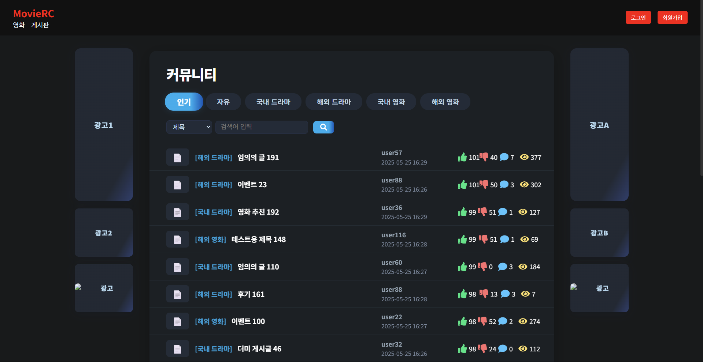

# 🎬 영화 리뷰 플랫폼


> 사용자들이 영화를 검색하고, 리뷰를 작성하고, 커뮤니티에서 소통할 수 있는 웹 애플리케이션입니다.



---

## 📑 목차

- [🔧 주요 기능](#-주요-기능)
- [🗂 기술 스택](#-기술-스택)
- [📁 프로젝트 구조](#-프로젝트-구조)
- [📜 변경 로그](#-변경-로그)
- [🛠 향후 계획](#-향후-계획)
- [📊 프로젝트 일정 (Gantt Chart)](#-프로젝트-일정-gantt-chart)
- [📄 라이선스](#-라이선스)
- [🙌 기여 방법](#-기여-방법)
- [👥 기여자들](#-기여자들)

---

## 🔧 주요 기능

### ✅ backend

- Django REST Framework 기반 API 서버
- JWT 인증 시스템 (Access/Refresh)
- 영화 등록/조회/수정/삭제 기능
- 리뷰 CRUD + 댓글 + 좋아요 + 정렬 + 이미지 업로드
- 커뮤니티 게시판: 글쓰기, 수정, 댓글, 추천/비추천 기능
- Swagger 자동 문서화 제공

📄 [백엔드 상세 문서 보기](./backend/README.md)

### ✅ frontend

- React 기반 넷플릭스 스타일 UI
- 로그인 / 회원가입 / 자동 로그인 / 보호 라우팅
- 영화 목록, 상세 페이지, 필터 및 정렬
- 리뷰 작성, 수정, 삭제, 좋아요, 이미지 업로드
- 커뮤니티 게시판 (카테고리, 글쓰기, 수정, 댓글 추천)
- 반응형 웹 대응

📄 [프론트엔드 상세 문서 보기](./frontend/README.md)


---

## 🗂 기술 스택

| 항목       | 기술 |
|------------|------|
| 언어        | Python 3.9+, JavaScript (ES6+) |
| 백엔드      | Django 5.2, Django REST Framework, SimpleJWT |
| 프론트엔드  | React 18, axios, react-router-dom v6 |
| 데이터베이스 | SQLite (개발), PostgreSQL (배포) |
| 인증        | JWT (Access/Refresh Token) |
| 문서화      | Swagger (drf-yasg) |
| DevOps      | GitHub, GitHub Actions (CI), Docker (배포) |

---

## 📁 프로젝트 구조

```
advanced-project/
├── backend/ # Django 백엔드
│ ├── board/ # 커뮤니티 게시판
│ ├── movies/ # 영화 관리
│ ├── ott/ # OTT 플랫폼
│ ├── reviews/ # 리뷰 + 댓글 + 이미지
│ ├── config/ # 설정 파일들
│ ├── docs/ # Swagger 이미지 및 문서
│ ├── media/ # 업로드된 미디어 파일
│ ├── manage.py
│ └── requirements.txt
│
├── frontend/ # React 프론트엔드
│ ├── public/ # 정적 HTML
│ └── src/
│ ├── api/ # axios 인스턴스
│ ├── components/ # Header 등 공통 컴포넌트
│ ├── pages/ # 각종 페이지 컴포넌트
│ ├── routes/ # PrivateRoute
│ ├── utils/ # 유틸 함수
│ └── App.jsx, index.js
│
├── docker-compose.yml # 전체 컨테이너 정의
├── .github/ # GitHub Actions 워크플로우
│ └── workflows/ci.yml
├── README.md # 프로젝트 메인 문서
└── .env.example # 환경 변수 예시 파일
```

---

## 📜 변경 로그

### V0.0.4 (2025-06-09)
- **게시판&리뷰 기능 최적화**

### v0.0.3 (2025-05-15)
- **backend 주요 기능 추가**
  - **더미 데이터 삽입 커맨드 추가**
    - `python manage.py seed_board` 명령어로 게시글/댓글/좋아요 자동 생성
    - 테스트 유저 2명(`user1`, `user2`) 생성 포함

- **frontend 주요 기능 추가**
  - **스포일러 블러/해제, 리뷰 작성/수정/삭제, 추천/비추천 기능 구현**
    - 스포일러 버튼 UI/UX 개선 (블러 처리 및 버튼 노출 로직 최적화)
  - **리뷰 기능 개선선** 
    - 리뷰 이미지 첨부 기능 및 평점 0.5 단위 입력 처리
    - 리뷰별 추천/비추천 **중복 방지**, 상태관리 로직 개선
    - 전체 코드 및 CSS 리팩토링

  - **커뮤니티 게시판 기능 구현**
    - 게시글 목록 페이지 (`/community`)
      - 카테고리별 필터링 탭 (자유/영화/드라마/인기 등)
      - 게시글 카드 클릭 시 상세 페이지로 이동
    - 게시글 작성 페이지 (`/community/write`)
      - 제목/내용/카테고리 입력, 작성 완료 시 목록으로 이동
    - 게시글 상세 페이지 (`/community/:id`)
      - 제목, 내용, 작성자, 작성일 출력
      - 댓글 작성/삭제/추천 기능 포함
      - 좋아요 수, 작성자 조건부 버튼 표시 등 구현
    - 게시글 수정 페이지 (`/community/edit/:id`)
      - 기존 데이터 불러와 수정 가능
      - 수정 완료 시 상세 페이지로 이동
  - **디자인 개선 (muko.kr 참고)**
    - 게시글 상세 페이지에 밝은 배경(`#f9f9f9`) + 어두운 글자색(`#333`)
    - 댓글/카드에 흰 배경 적용, 버튼은 하늘색 유지 (`#00AEEF`)
    - 기존 넷플릭스 스타일과 자연스럽게 연결되도록 통일된 UI 적용
  - **디자인 개선 (메인페이지, 영화 상세페이지)**
    - MoviesPage, MovieDetailPage 리팩토링

### v0.0.2 (2025-05-12)
- frontend, backend 연결 확인
- frontend 회원가입 및 로그인 페이지 구현
- README 파일 backend/frontend 분리
- **backend 주요 기능 추가**
  - **리뷰 기능 확장 및 고도화(backend)**
    - 스포일러 여부 필드(`is_spoiler`) 추가
    - 리뷰 이미지 첨부 기능 구현 (다중 이미지 업로드 및 응답 포함)
    - 리뷰 수정 이력 자동 저장 (`ReviewHistory`)
    - 수정 여부 반환 (`is_edited`)
    - `/reviews/{id}/history/`로 이력 조회 가능
  - **리뷰 댓글 기능 개선**
    - 댓글 추천(좋아요) 기능 추가
    - 추천순 상위 3개 댓글 우선 정렬 로직 적용
  - **리뷰 정렬 기능 강화**
    - 최신순, 평점순, 추천순 정렬 지원 (`ordering` 파라미터)
- **frontend 주요 기능 추가**
  - **사용자 인증 및 상태 관리**
    - JWT 기반 로그인 / 회원가입 구현
    - `localStorage`에 `accessToken` 저장하여 로그인 상태 유지
    - 로그인 성공 시 Header에 사용자 이메일 표시
    - 로그아웃 시 상태 초기화 및 토큰 삭제
    - 회원가입 시 자동 로그인 구현 완료
    - 로그인/회원가입 중 전체 화면 로딩 스피너 적용 
  - **넷플릭스 스타일 UI**
    - 로그인/회원가입을 하나의 화면에서 토글
    - 어두운 배경 + 빨간 버튼 컬러 강조
    - 모바일에서도 잘 작동하는 중앙 정렬 구조
    - `LoginPage`, `RegisterPage`, `AuthPage`로 구성
  - **보호 라우팅**
    - 로그인하지 않은 사용자가 접근 시 `/auth`로 리디렉션
    - `PrivateRoute.jsx`를 통한 경로 보호 구현
    - 예시: `/`, `/reviews`는 로그인한 사용자만 접근 가능
  - **MoviesPage.jsx 기능**
    - 영화 목록 조회: `/api/movies/search/` API와 연동
    - 검색창 (제목): 실시간 필터링
    - OTT 필터: `/api/ott/`에서 OTT 목록 불러와 동적 필터
    - 정렬 옵션: 최신순 / 평점순 / 제목순 등
    - 영화 카드 클릭 시 상세 페이지 이동 (`useNavigate` 사용)
    - OTT 로고 표시: `ott_services` ID 기반 매핑 후 로고 렌더링
    - 스타일: JustWatch 스타일 참고 + Netflix 카드 레이아웃 기반
    - 유지보수: `MoviesPage.css`에 별도 스타일 정리
  - **MovieDetailPage.jsx 기능**
    - `/api/movies/:id/` 기반 영화 상세 조회
    - 썸네일, 제목, 설명, 출시일, OTT 로고 표시
    - 평균 평점 표시 (별점 스타일)
    - 리뷰 목록 표시
    - Top 3 리뷰 강조 (추천순 정렬 기준)
    - 리뷰 작성 / 수정 / 삭제 / 좋아요 기능 포함
    - 수정 이력 존재 시 “(수정됨)” 표시
    - 리뷰 댓글 표시
    - 댓글 작성 / 삭제 기능 포함

### v0.0.1 (2025-05-05)
- 영화 등록, 목록 조회, 수정, 삭제 기능 구현
- JWT 인증 시스템 추가
- Swagger UI를 통한 API 테스트 기능 구현 등
- 전반적인 API 기능 구현

### v0.0.0 (2025-04-28)
- 프로젝트 계획 및 구조 설계
- frontend, backend 구조 생성성
- 기본 영화 모델과 OTT 연결 기능 구현

---

## 🛠 향후 계획

### ✅ 기능 개선

- 리뷰/게시글 알림 기능 (댓글/좋아요 반응 알림)

### ✅ 배포 및 인프라

- Docker + docker-compose 배포 자동화
- Nginx + Gunicorn + React 정적 배포 구성
- CI/CD: GitHub Actions로 테스트 자동화

---

## 📊 프로젝트 일정 (Gantt Chart)


위 이미지는 프로젝트의 주요 일정과 마일스톤을 시각적으로 보여줍니다. 각 단계는 다음과 같이 구성되어 있습니다:
1. **기능 설계 및 백엔드 개발**: API 설계 및 Django 기반 백엔드 구현.
2. **프론트엔드 개발**: React를 사용한 사용자 인터페이스 개발.
3. **통합 테스트 및 디버깅**: 백엔드와 프론트엔드 연동 테스트.
4. **배포 및 유지보수**: Docker를 활용한 배포 및 지속적인 업데이트.

---

## 📄 라이선스
 - 이 프로젝트는 MIT 라이선스를 따릅니다.

---

## 🙌 기여 방법

1. 이 저장소를 fork 합니다.
2. 새로운 브랜치를 만듭니다 (`git checkout -b feature/my-feature`)
3. 변경사항을 커밋합니다 (`git commit -m 'Add my feature'`)
4. PR을 보냅니다!

---

## 👥 기여자들

이 프로젝트에 기여해 주신 분들:

- [@slimshady913](https://github.com/slimshady913) - 주요 기능 개발, 문서화 및 테스트, 디자인 및 UI 개선

기여해 주셔서 감사합니다! 😊

---