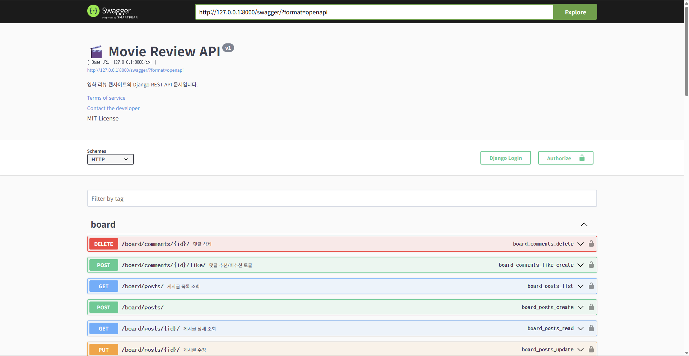
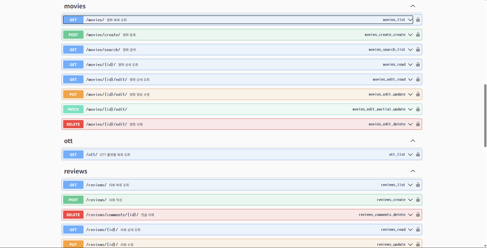
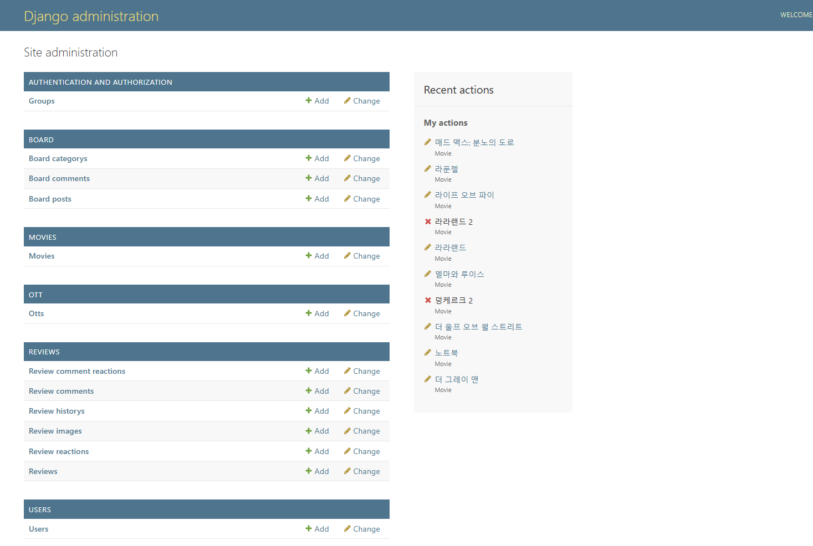

# 🛠 Backend - Django


> Django와 Django REST Framework 기반의 영화 리뷰/게시판 백엔드 API입니다.  
> Swagger로 API 문서화 및 테스트 지원, React 프론트엔드와 연동 가능합니다.

---

## 📑 목차
- [📁 프로젝트 구조 요약](#-프로젝트-구조-요약)
- [⚙️ 앱 책임 및 역할](#️-앱-책임-및-역할)
- [🔧 주요 기능](#-주요-기능)
- [📦 API 요약](#-api-요약)
- [⚙️ 시스템 설정 및 성능 최적화](#️-시스템-설정-및-성능-최적화)
- [🧩 주요 이슈 해결 내역](#-주요-이슈-해결-내역)
- [🚀 실행 방법](#-실행-방법)
- [🧪 샘플 데이터 삽입](#-샘플-데이터-삽입-옵션)
- [🔐 JWT 인증 사용법 (Swagger에서)](#-jwt-인증-사용법-swagger에서)
- [📷 미디어 파일 경로 예시](#-미디어-파일-경로-예시)
- [🔄 CI/CD (GitHub Actions)](#-cicd-github-actions)
- [🔗 프론트엔드 연동](#-프론트엔드-연동)
- [📎 라이선스](#-라이선스)

---

## 📁 프로젝트 구조 요약

```
backend/
├── board/         # 게시판 앱 (글, 댓글, 추천 등)
├── movies/        # 영화 등록/검색/정렬 기능
├── ott/           # OTT 플랫폼 정보 관리
├── reviews/       # 리뷰/댓글/이미지/추천
├── config/        # Django 설정 파일들
├── docs/          # Swagger 스크린샷 이미지 등
├── media/         # 업로드 이미지/첨부파일
├── manage.py      # Django 실행 진입점
├── requirements.txt
├── Dockerfile
└── entrypoint.sh
```

---

## ⚙️ 앱 책임 및 역할

| 앱 이름    | 설명                                                         |
|------------|-------------------------------------------------------------|
| `board`    | 게시판 글/댓글/추천, 주제별 게시판, 핫글 분류                |
| `movies`   | 영화 등록/조회/검색/정렬, OTT 연결                           |
| `ott`      | OTT 플랫폼 정보(이름, 로고, 링크) 관리                       |
| `reviews`  | 영화 리뷰/댓글/좋아요/이미지 첨부/수정 이력                  |
| `config`   | Django 설정, URL 라우팅, WSGI/ASGI 환경 구성                 |

---

## 🔧 주요 기능

### ✅ 사용자 기능
- JWT 기반 회원가입/로그인/토큰 발급
- 프로필 조회 및 OTT 구독 설정
- Swagger UI에서 Authorization 헤더 인증 테스트

### ✅ OTT 플랫폼 관리
- OTT 모델(이름, 로고 URL)
- 영화와 다대다(ManyToMany) 관계

### ✅ 영화 기능
- 영화 CRUD, 정렬(평점/개봉일/제목), 검색, OTT 필터링
- 평균 평점 캐시 및 정렬 최적화

### ✅ 검색 및 필터
- 제목 기반 검색, OTT 플랫폼 필터링
- `/api/movies/search/?search=키워드&ott_services=1,2`

### ✅ 리뷰 기능
- 영화별 리뷰 CRUD, 평점(1~5), 스포일러 여부
- 리뷰 추천/비추천, 정렬(최신/평점/추천순)
- 리뷰 댓글(작성/삭제/추천/정렬)
- 리뷰 수정 이력(자동 기록, `is_edited` 제공)
- 리뷰 이미지 첨부(여러 이미지 업로드)

### ✅ 게시판 기능
- 게시글/댓글 CRUD, 추천/비추천
- 주제별 게시판, 핫글 자동 분류
- 댓글 추천순+작성순 혼합 정렬

### ✅ API 문서화 (Swagger)
- drf-yasg 기반 자동 문서화(한글 설명)
- `/swagger/`에서 직접 테스트 가능

#### 🔍 Swagger 미리보기



### ✅ API 문서화 (🛠️ 관리자(admin) 페이지)
- Django 기본 admin 페이지 제공
- superuser 생성 후 접속:  
  ```bash
  python manage.py createsuperuser

- 접속 경로: http://localhost:8000/admin/
- 주요 관리 기능:
- 사용자(User) 관리 (가입, 권한, 정보 수정)
- 영화, OTT, 리뷰, 게시판, 댓글 등 모든 모델 데이터 관리 및 검색/필터
- 이미지/첨부파일 업로드 및 미리보기
- 각 앱별 커스텀 admin 옵션 적용(필드 검색, 리스트 필터, 인라인 관리 등)

#### 🔍 관리자 페이지 미리보기


---

## 📦 API 요약

| 기능         | 메서드 | 엔드포인트                       | 설명                        |
|--------------|--------|----------------------------------|-----------------------------|
| 회원가입     | POST   | `/api/users/register/`           | 사용자 회원가입             |
| 로그인       | POST   | `/api/token/`                    | JWT 토큰 발급               |
| 프로필 조회  | GET    | `/api/users/profile/`            | 로그인 사용자 정보 조회     |
| OTT 목록     | GET    | `/api/ott/`                      | OTT 플랫폼 목록             |
| 영화 목록    | GET    | `/api/movies/`                   | 영화 목록(정렬 포함)        |
| 영화 등록    | POST   | `/api/movies/`                   | 영화 등록                   |
| 영화 상세    | GET    | `/api/movies/{id}/`              | 영화 상세 조회              |
| 영화 수정    | PUT    | `/api/movies/{id}/`              | 영화 정보 수정              |
| 영화 삭제    | DELETE | `/api/movies/{id}/`              | 영화 삭제                   |
| 영화 검색    | GET    | `/api/movies/search/`            | 제목 검색+OTT 필터링        |
| 리뷰 작성    | POST   | `/api/reviews/`                  | 리뷰 작성                   |
| 리뷰 수정    | PUT    | `/api/reviews/{id}/`             | 리뷰 수정                   |
| 리뷰 삭제    | DELETE | `/api/reviews/{id}/`             | 리뷰 삭제                   |
| 리뷰 목록    | GET    | `/api/reviews/?movie_id=ID`      | 영화별 리뷰 목록            |
| 리뷰 좋아요  | POST   | `/api/review-likes/`             | 리뷰 좋아요 등록            |
| 리뷰 좋아요 취소 | DELETE | `/api/review-likes/{id}/`      | 좋아요 취소                 |
| 리뷰 댓글    | POST   | `/api/review-comments/`          | 리뷰에 댓글 작성            |
| 게시글 작성  | POST   | `/api/board/posts/`              | 게시판 글 작성              |
| 게시글 목록  | GET    | `/api/board/posts/`              | 게시판 목록 조회            |
| 게시글 수정  | PUT    | `/api/board/posts/{id}/`         | 게시글 수정                 |
| 게시글 삭제  | DELETE | `/api/board/posts/{id}/`         | 게시글 삭제                 |
| 게시글 댓글  | POST   | `/api/board/comments/`           | 게시글 댓글 작성            |
| 댓글 삭제    | DELETE | `/api/board/comments/{id}/`      | 게시글 댓글 삭제            |

---

## ⚙️ 시스템 설정 및 성능 최적화
- CORS 설정 완료 (React 연동)
- django_filters 적용
- REST_FRAMEWORK 인증/필터 등 설정 정리
- 리뷰 정렬 기능 확장(ordering 파라미터 지원)

---

## 🧩 주요 이슈 해결 내역

- **2025-06-09**: 리뷰 정렬 선택시 깜빡거림 수정
- **2025-06-02**: 캡챠 기능 추가
- **2025-05-28**: 보안문제 해결(httponly)
- **2025-05-21**: 게시판 관련 문제들 해결
- **2025-05-12**: 리뷰 수정 시간 및 이력 기록 기능 추가
- **2025-05-07**: average_rating_cache 필드 마이그레이션 누락 → 정상 반영, 리뷰 모델에 updated_at 필드 추가, 정렬 오류 → 캐시 필드 기반 정렬로 변경, Swagger에서 영화/리뷰 API 테스트 완료

---

## 🚀 실행 방법

### 1. 가상환경 설치 및 패키지 설치
```bash
python -m venv venv
source venv/bin/activate  # Windows: venv\Scripts\activate
pip install -r requirements.txt
```

### 2. 마이그레이션 및 서버 실행
```bash
python manage.py makemigrations
python manage.py migrate
python manage.py runserver
```

### 3. Swagger 접속
- http://localhost:8000/swagger/

### 4. Docker 환경 실행
```bash
docker-compose up --build
```

---

## 🧪 샘플 데이터 삽입 (옵션)
```bash
python manage.py seed_board         # 게시판 샘플 데이터
python manage.py seed_movies        # 영화 및 OTT 데이터
python manage.py loaddata dumpdata.json  # 전체 더미 데이터
```

---

## 🔐 JWT 인증 사용법 (Swagger에서)
1. `/api/token/`에서 access, refresh 토큰 발급
2. Swagger 우측 상단 **Authorize** 클릭
3. `Bearer <access_token>` 입력 후 인증
4. 인증 후 Swagger에서 각 API 테스트 가능

---

## 📷 미디어 파일 경로 예시
- 리뷰 이미지: `/media/review_images/{파일명}`
- 게시글 첨부파일: `/media/board_attachments/{파일명}`
- MEDIA_URL, MEDIA_ROOT 설정은 settings.py 참고

---

## 🔄 CI/CD (GitHub Actions)
- `.github/workflows/ci.yml` 포함
- Push 시 자동 테스트 실행

---

## 🔗 프론트엔드 연동
- CORS 설정(`CORS_ALLOW_ALL_ORIGINS = True`)으로 React 연동
- 기본 프론트엔드: `http://localhost:3000`
- JWT 인증 기반 React 헤더에 사용자 이메일 표시

---

## 📎 라이선스
MIT License